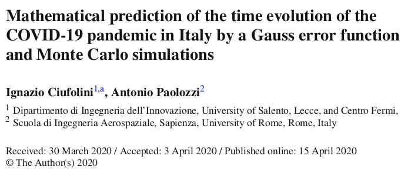
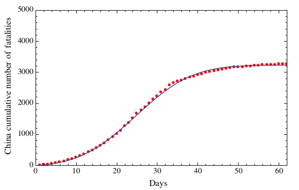
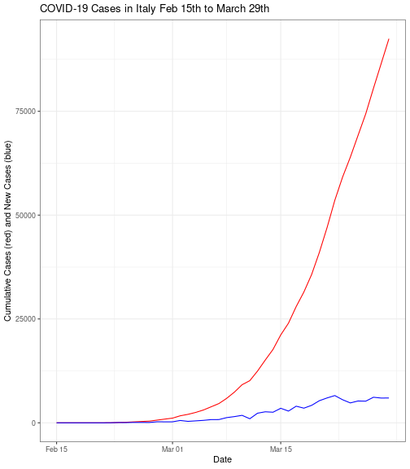
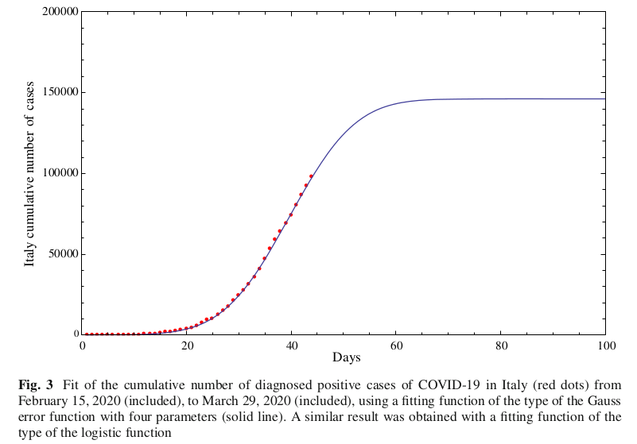
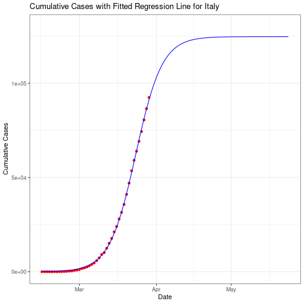
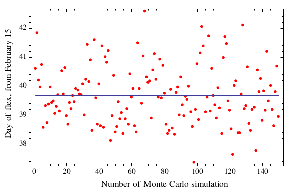
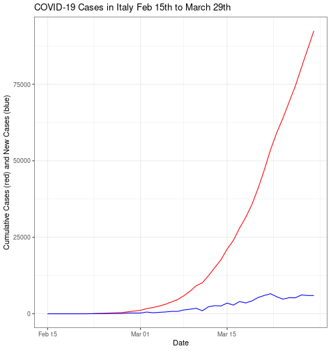
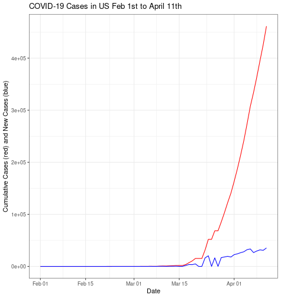
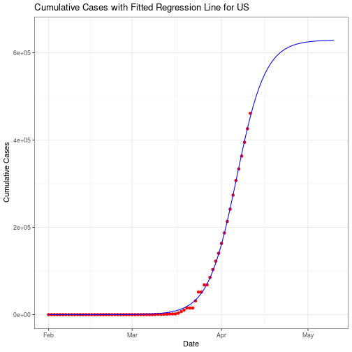

Estimating COVID-19 Trends
========================================================
author: Caroline Thomas, Spencer Kuhn, George Laird
date: December 9, 2020
autosize: true


Source Paper
========================================================



- Modeling the progression of COVID-19 cases/fatalities during first few months of pandemic
- Predicting the progression of these cases into the future including:
  - Flex date (inflection point = rate of new cases decelerates)
  - Date of substantial reduction in cases (less than 100 new cases)

Scope of the source paper
========================================================

- Italy and China
- Cases and Fatalities
- Monte Carlo



COVID-19 in Italy
========================================================



- Italy as leader in deaths (3-19)
- Healthcare Shortages

Original Italian Regression
========================================================

- Error Function: $a + b \space \text{erf} (cx − d)$
- Use of multiple models



- Estimated Flex Date: March 25th (40 days)

Our Italian Regression
========================================================

Non-linear least squares Regression:
$\frac{a}{1 + e^{-(b+cx)}}$

$a = 100,000$, $\space b = -10.242$, $\space c = 0.294$



- Estimated Flex Date: March 23rd (38 days)

Role of Monte Carlo
========================================================

<font size="5">

- Estimation the effect of measurement errors

- Case totals from Feb 25th - 27th


```
[1] 229 322 400
```

- For this example we'll use m = 5, n = 3

- Generating realizations of $X \sim Normal(1,0.1)$


```
          [,1]      [,2]      [,3]
[1,] 1.0872916 0.8531454 0.7876457
[2,] 1.0667111 0.9604324 1.0439247
[3,] 1.0106036 0.9671163 0.9029378
[4,] 0.9161744 1.0044319 0.8342633
[5,] 1.1395699 0.9652339 1.0628076
```

- Multiplying this vector by our original data


```
        V1       V2       V3
1 248.9898 274.7128 315.0583
2 244.2768 309.2592 417.5699
3 231.4282 311.4114 361.1751
4 209.8039 323.4271 333.7053
5 260.9615 310.8053 425.1230
```

- Using these simulations for regression

</font>

Original Monte Carlo Implementation
========================================================



- Estimated Flex Date Range: March 23 - March 27 (38-42 days)

Our Italian Monte Carlo
========================================================


- Estimated Flex Date Range: March 23 - March 25 (38-40 days)

Extension: United States
========================================================



United States Regression
========================================================

Non-linear least squares Regression:
$\frac{a}{1 + e^{-(b+cx)}}$

$a = 700,000$



- Estimated Flex Date: April 7 (67 days)

United States Monte Carlo
========================================================


- Estimated Flex Date: April 6 - April 7 (66-67 days)

Limitations
========================================================

<font size="12">

- Differences in tests provided in a single day
- Changes over time in testing efforts
- Changes over time in lockdown procedures
- Effects of future lockdown procedures

</font>

Discussion
========================================================

<font size="12">

- How do our flex date estimates perform?
- Differences in lockdown procedures

</font>


Works Cited
========================================================

<font size="5">

MLA Works Cited:

Ciufolini, Ignazio and Paolozzi, Antonio. “Mathematical prediction of the time evolution of the COVID-19
pandemic in Italy by a Gauss error function and Monte Carlo simulations.” The European Physical Journal
Plus. vol. 135, no. 355, 2020.

Cheng, Brian. “Modeling Logistic Growth Data in R.” Marine Global Change Ecology. University of
Massachusetts Amherst, 7 May 2014. https://bscheng.com/2014/05/07/modeling-logistic-growth-data-in-r/.
Accessed 6 December 2020.

Fernandez, Marisa. “Timeline: How the U.S. fell behind on the coronavirus.” Axios. Axios Media, 10
April 2020. https://www.axios.com/coronavirus-timeline-trump-administration-testing-c0858c03-5679-410b-
baa4-dba048956bbf.html. Accessed 8 December 2020.

Lawler, Dave. “Timeline: How Italy’s coronavirus crisis became the world’s deadliest.” Axios. Axios Media,
24 March 2020. https://www.axios.com/italy-coronavirus-timeline-lockdown-deaths-cases-2adb0fc7-6ab5-
4b7c-9a55-bc6897494dc6.html. Accessed 8 December 2020.

“WHO Coronavirus Disease (COVID-19) Dashboard.” World Health Organization. World Health Organization, 8 December 2020. https://covid19.who.int/table. Accessed 8 December 2020.

</font>
