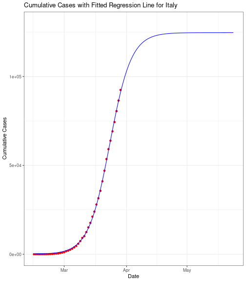
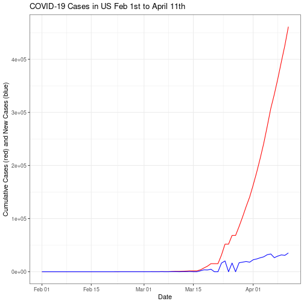

Estimating COVID-19 Peaks
========================================================
author: Caroline Thomas, Spencer Kuhn, George Laird
date: December 9, 2020
autosize: true


========================================================
# Source Paper


- Modeling the progression of COVID-19 cases/fatalities over the past weeks
- Predicting the progression of these cases into the future
- Predicting a peak day, where the greatest number of new cases is reported


========================================================
# Scope of the source paper

- Italy and China
- Cases and Fatalities
- Monte Carlo

========================================================

# Original Italian Regression


========================================================

# Our Italian Regression



========================================================

# Original Italian Monte Carlo


========================================================

# Our Italian Monte Carlo


```r
Italy_MC
```


========================================================
# Extension: United States Regression


```r
US_Data
```


```r
US_Regression
```


========================================================
# Extension: United States Monte Carlo


```r
US_MC
```



========================================================
# Limitations

- Differences in tests provided in a single day
- Changes over time in testing efforts
- Changes over time in lockdown procedures
- Effects of future lockdown procedures

========================================================
# Works Cited

MLA Works Cited:

Ciufolini, Ignazio and Paolozzi, Antonio. “Mathematical prediction of the time evolution of the COVID-19 pandemic in Italy by a Gauss error function and Monte Carlo simulations.” The European Physical Journal Plus. vol. 135, no. 355, 2020.

Cheng, Brian. “Modeling Logistic Growth Data in R.” Marine Global Change Ecology. University of Massachusetts Amherst, May 7, 2014. https://bscheng.com/2014/05/07/modeling-logistic-growth-data-in-r/. Accessed 6 December 2020.
